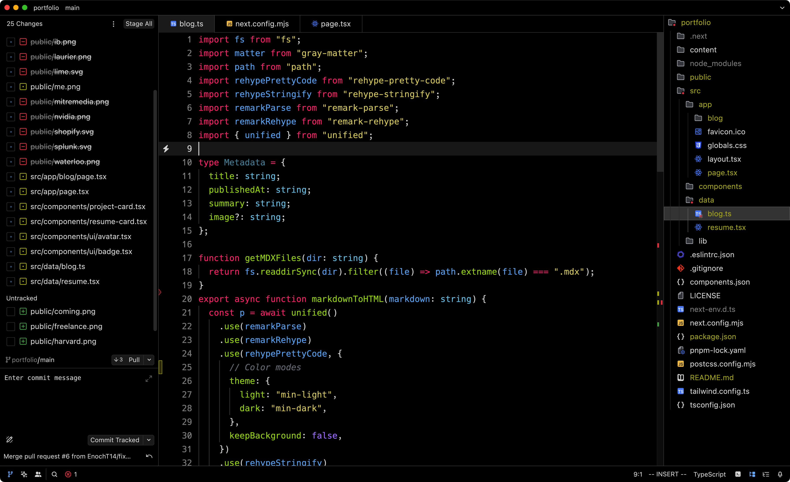

  

<h1 align="center">Monokai Night for Zed</h1>

## Monokai Night

## Previews

  
🌃 Monokai Night

  

  
🎑 Monokai Night Soft

  

<!-- 

  
🌄 Monokai Morning

  

 -->

## Usage
### Install the Monokai Night Theme
1. Open the Command Palette (<kbd>Cmd</kbd>+<kbd>Shift</kbd>+<kbd>P</kbd>) and type `zed: extensions`.
2. Search for the _Monokai Night_ extension and install it.
3. Type `theme selector: toggle` and select _Monokai Night_ or _Monokai Night Soft_.

### Install Manually
1. Download the [Monokai-Night.json](./themes/Monokai-Night.json) theme file.
2. Place it in the `~/.config/zed/themes/` directory.

### Activate the Theme
1. Type `theme selector: toggle` and select _Monokai Night_ or _Monokai Night Soft_.

## Editor settings
| Setting        | Value                                                                                                                            |
| -------------- | -------------------------------------------------------------------------------------------------------------------------------- |
| Editor font    | [Hack](https://github.com/ghsgz/a-custom-Hack-Font 'Hack font') (modified version ["i", "1" and "0"])                            |
| UI font        | SF Pro Text; alternatively use [Inter](https://rsms.me/inter/ 'Inter font')                                                      |
| Icons          | JetBrains New UI Icons (Dark)                                                                                                    |
| Other settings | See the [setting file](https://github.com/farbodvand/dotfiles/tree/main/.config/zed/settings.json 'Inter font') from my dotfiles |
